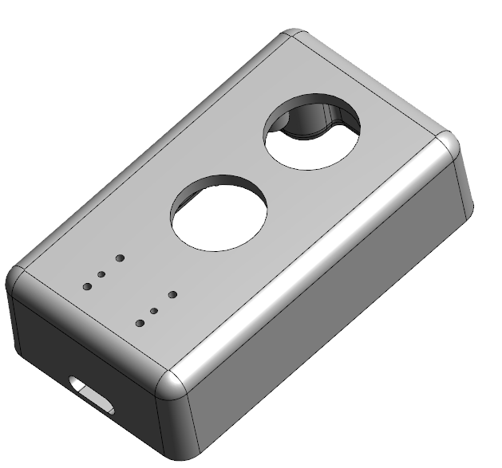
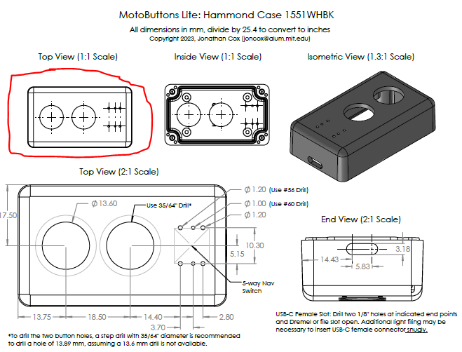
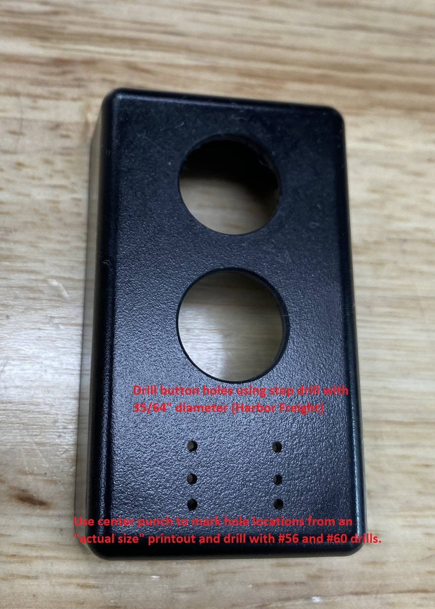
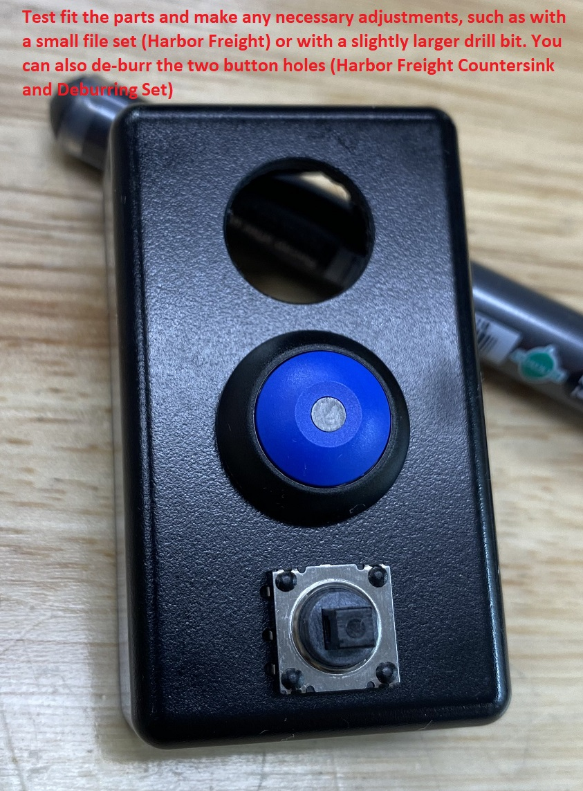
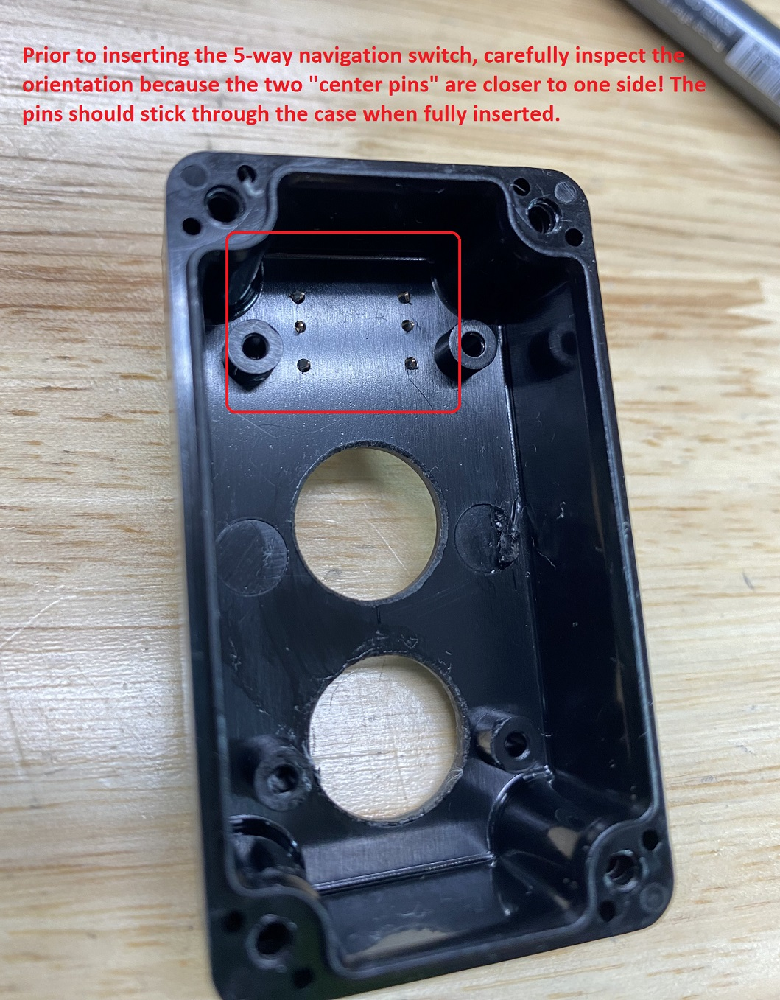
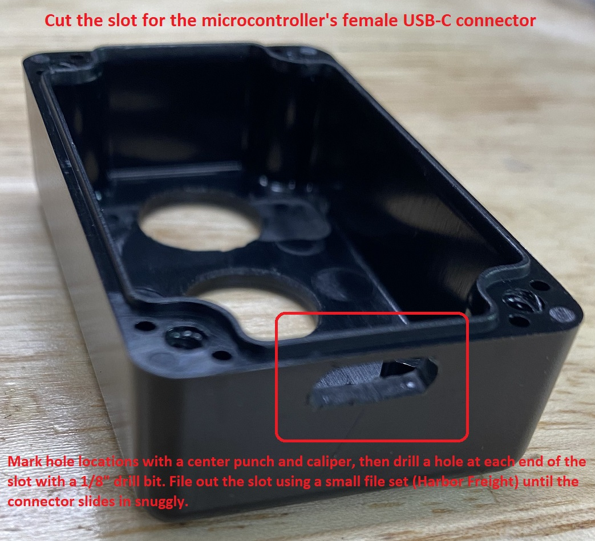
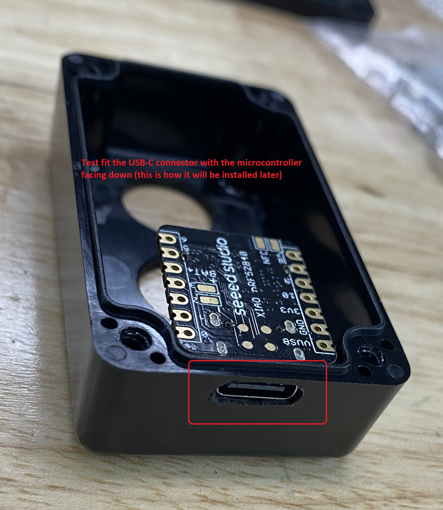

# Construction (building your MotoButtons Lite)
Building your own MotoButtons Lite requires no programming experience, only relatively basic hand tools and DIY skills. However, if you are not moderately competent at soldering, working with glue and sealants and drilling precision holes, you might want to ask a friend for help. 

### Be Prepared
First, you'll need to acquire the necessary components, tools and supplies, as mentioned on the [main page](https://github.com/joncox123/MotoButtons/tree/main#recommended-tools-and-supplies). Most DIY enthusiasts will have many of these tools and supplies, except for the parts from Mouser, the slow curing epoxy, and the necessary drill bits.

## Let's Get Started
### Machine the Enclosure
First, you need to make the necessary modifications to the Hammond IP68 rated enclosure. While I used a milling machine to do this, it's readily possible with the proper hand tools, technique and attention to detail. Take a look at the [3D model (3D PDF)](../Enclosure/MotoButtons%20Lite%20Enclosure%201551WH%20Bottom%203D.pdf) to get an idea of what you will be doing.

First, print out the [schematic drawing](../Enclosure/MotoButtons%20Lite%20Enclosure%201551WH%20Bottom.pdf) of the enclosure, making sure to print as "actual size", so that the print is scaled exactly as indicated. You may want to check the dimensions with a caliper or ruler to verify that you printed it out true to scale. 

Cut out the top left diagram titled "Top View (1:1 Scale)" and carefully tape it over the top of the enclosure. Do your best to center it on the case and avoid any wrinkles in the paper. Use an automatic center punch to very precisely create indentations (divots) on the center of each of the 8 holes. This can be done by placing the tip of the center punch directly over the center markings of each hole and pressing down. You might want to practice this step on a piece of plastic or wood as it is easy to misjudge the center of the punch. 

After you have created the eight marks, carefully clamp the case in a vise [recommend soft vise jaws](https://www.amazon.com/HORUSDY-Universal-Magnetic-Retention-Urethane/dp/B078MVLSZS) and drill the two large button holes (on the mark centers) with a small pilot drill about 1/8" diameter. When clamping the case, keep in mind that it is strong, but polycarbonate can suddenly crack if too much force is applied. Tighten the vise just enough to hold the case securely when moved by hand. After drilling the pilot holes, drill both holes out to 36/64" using a step drill. Set your hand drill or drill press to a low speed for this step to avoid chatter. 

Finally, you will drill the small holes for the electrical pins of the 5-way navigation switch (joystick). This step is challenging to do with a hand drill because the small drill bits tend to break easily with the slightest deflection--so be careful and wear safety glasses. The upper and lower holes will use the #56 bit, and the two "middle" holes will use the smaller #60 bit. **Notice that the two "middle" holes are not exactly in the middle. The orientation of the switch matters!**  When you are done, your case should look as follows:

Before proceeding, test fit the buttons and the navigation switch. **Caution: the switch must be inserted in the six holes with the correct orientation! The two middle holes are closer to one side.**

### Cut Off the Circuit Board Posts (Optional)
If you ordered the buttons with screw thread mounting, as opposed to the snap on ones, you'll need to cut off two of the PCB mounting posts on the inside of the case. Otherwise, you won't be able to properly tighten the nut to secure the top button. Its possible to omit this step by ordering the snap in buttons, but the waterproofing won't be as good unless you are also potting the case with epoxy. 

**Nevertheless, if you are going to pot with epoxy, you could simply tighten the nut the best you can without cutting off the posts, and skip this step.**

Use a dremel with a small cut off wheel to cut off the upper posts. Then sand the area flat using a sanding wheel. *I used a milling machine and a 7/32" end mill to do this step, so it might be a good idea to omit this step unless you are confident in your abilities and tools.*

### Machine the USB-C Connector Slot (Optional)
If you are planning to epoxy fill (pot) the enclosure, for the ultimate in durability and waterproofing, you may wish to cut a slot for the USB-C connector on the microcontroller. This will allow you to update the firmware in the future, should additional functionality become available (or if you wish to modify the source code yourself). 

The slot for a female USB-C connector is approximately 1/8" (3.18 mm) tall and 9 mm wide (end to end). Therefore, using the center punch, mark two horizontally spaced holes that are 5.83 mm apart by printing out the template and using a center punch or using a caliper. Drill both holes with a 1/8" drill bit. Using a needle file set, carefully file out the slot. You will need to test fit the slot with the microcontroller, as shown below. This will require some trial and error, as it is necessary to file the ends using the round file and the straight edges with a flat file until the connector fits snuggly. I used a milling machine with a 1/8" endmill to do this, although I still had to do manual filing to get the connector to fit.

## Glue 5-Way Navigation Switch to Case
Congratulations, you've successfully machined your enclosure! The next step is to glue the joystick to the outside of the case using epoxy glue, and then seal the rubber boot over it with silicone sealant. 

